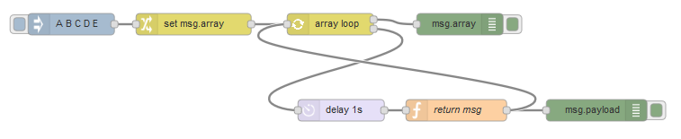
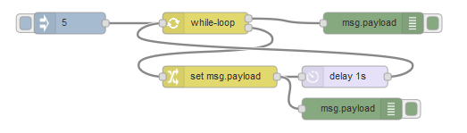

node-red-contrib-loop-processing
====

Node-RED nodes to help a flow looping.

## Description

This module has 3 nodes.

- [counter-loop](#counter-loop)
- [array-loop](#array-loop)
- [while-loop](#while-loop)

### counter-loop

Using a counter variable, a flow loops like a for-loop.

Set the following inputs:
- property using as the counter variable
- initial value
- terminal value (and operator)
- increment value

If the conditions is true, a flow is sent to the lower output port ('true' outputLabel).  
If false, the flow is sent to the upper output port ('false' outputLabel). 

When the flow exits the loop, the counter variable can reset by setting to `null`, `undefined` or empty string. This is useful for creating a multi-loop.

### array-loop

Until the end of an array, a flow loops. This node is similar to forEach or for-of,
but this node cannot handle an associated array.

Set the following inputs:
- property using as the key variable
- array

If the conditions is true, a flow is sent to the lower output port.  
If false, the flow is sent to the upper output port ('end loop' outputLabel). 

When the flow exits the loop, the key variable can reset by setting to `null`, `undefined` or empty string. This is useful for creating a multi-loop.

### while-loop

*since 0.2.0*

Using a condition expression, a flow loops like a while loop.

If the expression is true, a flow is sent to the lower output port ('true' outputLabel).  
If false, the flow is sent to the upper output port ('false' outputLabel). 

## Usage

Example flow is in examples/example.json.

Drag & drop in your Node-RED editor.

## Install

## Changelog

[Changelog](https://github.com/s1r-J/node-red-contrib-loop-processing/blob/master/CHANGELOG.md)

## Licence

[Apache-2.0](http://www.apache.org/licenses/LICENSE-2.0.html)

## Author

[s1r-J](https://github.com/s1r-J)